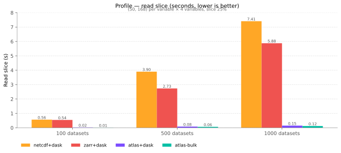
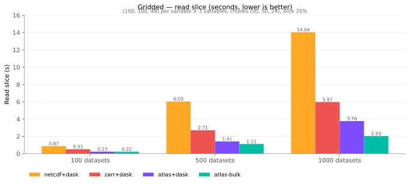

# vs Zarr / netCDF

`atlas` lives in the same neighbourhood as
[Zarr v3](https://zarr.dev/) and
[netCDF4](https://www.unidata.ucar.edu/software/netcdf/): all three store
labelled N-D arrays with chunking and compression, and all three are
reachable from xarray. They differ in **layout**, which is what makes atlas
faster on a specific class of workloads and slower on others.

## What each one is, in one line

| | Unit of storage | "Many datasets" layout |
|---|---|---|
| **netCDF4** | One self-describing `.nc` file per dataset | N separate `.nc` files (or one file with N internal groups) |
| **Zarr v3** | One directory of chunk files per array | N separate `.zarr` stores (or one store with N groups) |
| **atlas** | One directory holding **N** datasets, sharing physical files by array name | N datasets in **one** store, by construction |

The first column is the natural unit each format optimises for. Atlas is the
only one of the three whose natural unit is "a fleet of related datasets",
which is why the comparison gets interesting once N gets large.

## How atlas stores N datasets

When ten datasets all `define_array("temperature", ...)` with the same
schema, atlas writes them all into one `temperature/data.af` file, keyed by
dataset name inside the file. Adding the 1000th dataset that re-uses an
existing schema is **one append + one `atlas.json` rewrite**, not 1000 new
directories. `Atlas.list_arrays()` returns the *distinct* array names in
the store — usually a small constant — while `Atlas.list_datasets()`
returns the logical names that may run into the thousands.

This shape unlocks two further wins:

- **Bulk cross-dataset reads.** `Atlas.read_array_across_stacked(array,
  names, start, shape)` shares a single `RwLock::read` guard on the shared
  physical file and dispatches N per-dataset reads on the tokio runtime,
  filling a pre-allocated `(N, *slice_shape)` numpy buffer. One PyO3 round
  trip, no Python-side `np.stack` copy. The closest zarr equivalent is
  `open_mfdataset(..., parallel=True).isel(...).load()`, which still has to
  open N stores and run the slice through xarray.
- **One flush amortises N writes.** Atlas's mutations are in-memory until
  `flush()`; N consecutive `add_xarray_dataset` calls produce one delta file per
  touched array name regardless of N. See
  [Durability and flushing](guides/durability.md).

## Where atlas wins (with numbers)

These come from the same harness as the [Benchmarks](benchmarks.md) page.
Each chart sweeps **datasets ∈ {100, 500, 1000}**; the per-case tables
that follow zoom in on the 1000-dataset row with full write and storage
columns. zarr and netcdf are run via their canonical
`xr.open_mfdataset(parallel=True, ...)` paths (dask under the hood);
atlas runs via either the `dask.delayed` per-dataset fan-out
(`--use-dask`) or the bulk PyO3 path (`Atlas.read_array_across_stacked`).

### `profile` case

`(50, 168)` per variable × 4 variables, slice 25%. Overhead-dominated;
the per-dataset work is small enough that file-open / metadata cost
dominates the netCDF and zarr read paths.



At 1000 datasets:

| Backend | Read slice (s) | Write (s) | Storage (MiB) |
|---|---:|---:|---:|
| **atlas-bulk** (`Atlas.read_array_across_stacked`) | **0.122** | 1.24 | 110 |
| **atlas+dask** (`view.read_arrays` in `dask.delayed`) | **0.148** | 5.63 | 110 |
| zarr+dask (`open_mfdataset(parallel=True)`) | 5.879 | 16.35 | 119 |
| netcdf+dask (`open_mfdataset(parallel=True)`) | 7.409 | 4.32 | 117 |

On the small-per-dataset workload atlas-bulk reads **~48× faster than
zarr** and writes **~13× faster**. The gap *widens* with dataset count
because per-dataset open cost compounds for the netcdf/zarr paths but
amortises to one PyO3 call for atlas-bulk.

### `gridded` case

`(100, 100, 48)` per variable × 3 variables, chunks `(50, 50, 24)`,
slice 25%. Decompression-dominated; ~1.8 GB raw. All backends push the
slice down to chunk-level reads.



At 1000 datasets:

| Backend | Read slice (s) | Write (s) | Storage (MiB) |
|---|---:|---:|---:|
| **atlas-bulk** (`Atlas.read_array_across_stacked`) | **2.031** | 53 | 6387 |
| **atlas+dask** (`view.read_arrays` in `dask.delayed`) | **3.763** | 62 | 6387 |
| zarr+dask (`open_mfdataset(parallel=True)`) | 5.968 | 31 | 6392 |
| netcdf+dask (`open_mfdataset(parallel=True)`) | 14.037 | 113 | 5596 |

On the large-per-dataset workload `atlas-bulk` is **2.9× faster than
zarr** and **6.9× faster than netcdf** on slice reads. zarr remains the
fastest writer for chunked grids — its independent chunk files
parallelise cleanly on write, where atlas's single shared file per
array name serialises through one writer.

## Where Zarr / netCDF still win

- **Concurrent writers.** Many independent processes writing the same
  store is Zarr's home turf; chunk files are independent and
  parallel-writable. atlas assumes a single writer per store and
  serialises through one in-memory `StoreMeta`. This is still the case
  on cloud backends — `pip install "atlas-python[cloud]"` lets atlas read
  and write S3 / GCS / Azure via [obstore](https://github.com/developmentseed/obstore),
  but it doesn't lift the single-writer assumption.
- **Distributed dask schedulers.** Atlas's lazy-read graph captures the
  `DatasetView` directly, which isn't picklable across processes. Use
  `.compute()` (or one of the bulk-read APIs) before handing off to
  `dask.distributed` / `processes` schedulers. Zarr stores have no such
  restriction.
- **Ecosystem breadth.** netCDF has decades of tooling (`ncdump`,
  `cdo`, `nco`, GIS integrations) and Zarr is the de-facto interchange
  format for cloud-scale array data. Atlas is a focused fit for "N small
  datasets, same schema, one writer".

## Compatibility bridge

Atlas reads and writes `xr.Dataset` natively, so the migration cost from a
zarr / netCDF pipeline that already uses xarray is one line:

```python
# Before — zarr
ds = xr.open_zarr("/data/jan_2024.zarr")

# Before — netCDF
ds = xr.open_dataset("/data/jan_2024.nc")

# After — atlas
ds = atlas.Atlas.open("/data/store").open_as_xarray_dataset("jan_2024")
```

Per-variable attrs (`units`, `long_name`, …), `_FillValue`, coord
distinctions, and `datetime64[ns]` all round-trip. See
[xarray integration](guides/xarray.md) for the storage conventions and the
known limitations.
